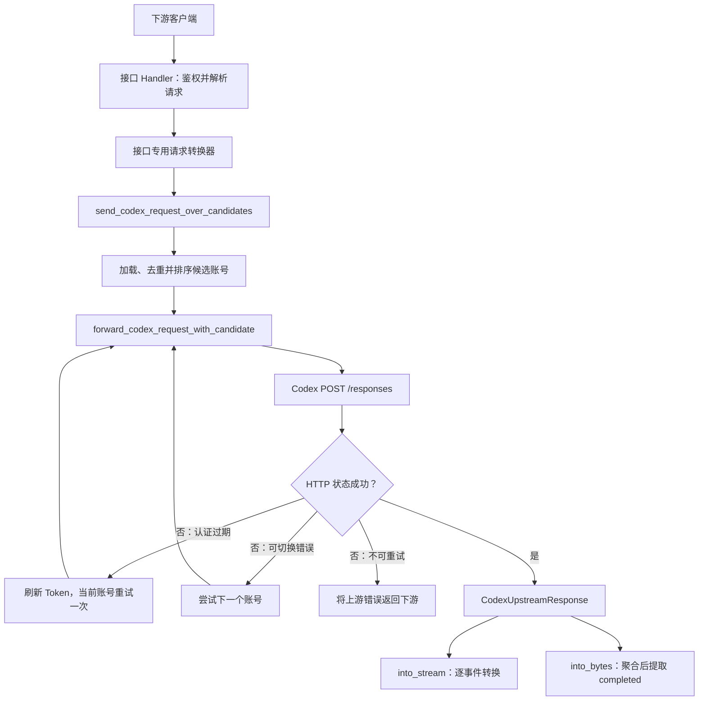

# API 代理接口链路索引

本文档集按下游接口分别描述三个阶段：客户端请求如何转换成 Codex Responses 请求、Codex 上游返回什么，以及代理如何处理后返回给下游。

所有需要模型推理的接口最终都调用：

```text
POST {upstream_base_url}/responses
```

当前实现中，HTTP 上游请求固定使用 `stream: true`，所以 Codex 返回 SSE；下游是否流式，仅决定代理是逐事件转换还是先聚合完整 SSE。

## 接口文档

| 下游接口 | 文档 | 下游协议 |
|---|---|---|
| `POST /v1/chat/completions` | [Chat Completions](./chat-completions.md) | OpenAI Chat Completions |
| `POST /v1/responses` | [Responses HTTP](./responses-http.md) | OpenAI Responses |
| `GET /v1/responses` Upgrade | [Responses WebSocket](./responses-websocket.md) | Responses WebSocket |
| `POST /v1/messages` | [Anthropic Messages](./anthropic-messages.md) | Anthropic Messages |
| `POST /v1/claude/v1/messages`、`POST /v1/claude/messages` | [Claude Messages 别名](./claude-messages.md) | Anthropic Messages |
| `POST /v1/images/generations` | [Images Generations](./images-generations.md) | OpenAI Images |
| `POST /v1/images/edits` | [Images Edits](./images-edits.md) | OpenAI Images |
| `POST /v1/images/variations` | [Images Variations](./images-variations.md) | OpenAI Images |

## 共享上游链路



## 共享响应处理规则

- `CodexUpstreamResponse::Http` 通过 `reqwest::Response::chunk()` 读取字节。
- `SseDecoder` 跨 chunk 缓冲数据，以 `\n\n` 或 `\r\n\r\n` 切分事件。
- 解析器保留 `event:` 和 `data:`，不保留 `id:`、`retry:` 与注释行。
- 流式处理会从完成事件记录 token 用量。
- 非流式处理通过 `extract_completed_response_from_sse()` 查找 `response.completed`；找不到时返回 `502`。
- 响应头不会透传 `content-length`、`connection`、`transfer-encoding` 和原始 `content-type`。
- `/health`、`GET /debug/claude-codex`、`POST /debug/claude-codex/preview`、模型列表和 Claude `count_tokens` 是本地接口，不调用 Codex 上游，因此不在本目录展开。
- Claude-Codex 协议示波器可在代理运行后打开 `http://127.0.0.1:8787/debug/claude-codex`；页面同源调用消息路由，不需要也不会启用宽松 CORS。
- `POST /debug/claude-codex/preview` 需要本地代理 `x-api-key` 和 `anthropic-version`，只复用生产转换函数生成上游调用预览，返回脱敏 headers、最终 body 和占位 curl，不选择账号、不读取 access token、不发起上游网络请求；Anthropic/Claude 预览里的最终 body 也会显示 `max_output_tokens`、`truncation` 和 `context_management` 均未透传。
