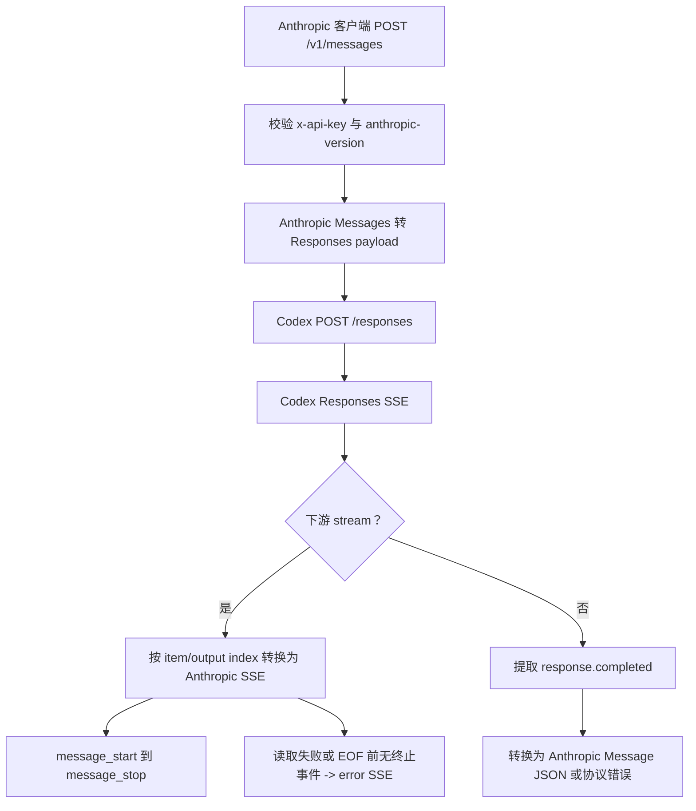

# `POST /v1/messages`

## 请求到上游

这是 Anthropic Messages 兼容入口。请求使用本地代理 API Key，并校验 `anthropic-version`。`convert_anthropic_messages_request_to_codex()` 将 `system`、`messages`、content blocks、tools、tool choice、thinking、停止条件和采样参数转换为 Codex Responses payload。

下游的 `stream` 被单独保存；上游仍强制使用 SSE。

转换时会严格校验 Anthropic 消息结构：

- `max_tokens` 是有效 Anthropic 下游输入，但不会转发为 Codex `max_output_tokens`；源请求里的 `truncation` 也不会转发，因为 Codex 上游当前会拒绝这两个字段
- `messages[].role` 接受 `user`、`assistant`，并兼容 Claude Code 发来的 `system`；`system` 消息会与顶层 `system` 合并为 Codex `instructions`
- `assistant` 中的 `tool_use` 必须有非空 `id`、非空 `name`，`input` 必须是对象
- `user` 中的 `tool_result` 必须有非空 `tool_use_id`
- `tools[].name` 必须非空，`input_schema` 如果存在必须是对象
- `tool_choice`、`stop_sequences`、`context_management.edits` 会校验形状和支持的取值
- `context_management.edits` 本地支持 `compact_20260112` 和 `clear_thinking_20251015`；`clear_thinking_20251015.keep` 可省略、为 `"all"`，或为 `{ "type": "thinking_turns", "value": 正整数 }`

`tool_result.content` 支持字符串、文本 block、图片 block、结构化/未知 block；Codex function output 只能承载字符串，所以非文本内容会以 JSON 文本保留，`is_error` 会显式写入输出。Claude Code context management 不调用未公开的 `/responses/compact`，不会透传给 Codex，只把 compaction/thinking/redacted_thinking 转成安全文本上下文。

## 上游结果

上游返回 Codex Responses SSE，而不是 Anthropic SSE。

## 下游处理

- `stream: true`：`build_anthropic_streaming_response()` 维护 `AnthropicStreamState`，把 Codex 文本、reasoning summary、工具调用和完成事件转换成 Anthropic 的 `message_start`、`content_block_*`、`message_delta`、`message_stop` 等事件。
- 并行/交错工具调用按 Responses item/output index 跟踪，不共享单个“当前工具调用”。
- `stream: false`：聚合 SSE 并提取 `response.completed`，然后 `convert_completed_response_to_anthropic_message()` 生成 Anthropic Message JSON。
- Codex 非空 `function_call.arguments` 必须是 JSON 对象；非法 JSON 或数组/字符串会返回显式协议错误，不会静默变成 `{}`。
- 流读取失败或 EOF 前没有终止事件：返回一个 Anthropic `error` SSE 事件；非流式读取或解析失败返回 `502`。
- reasoning summary 会作为普通 `text` block 保留；代理不会伪造 Anthropic extended thinking 的签名。

实现入口：`anthropic_messages_handler`、`convert_anthropic_messages_request_to_codex`、`build_anthropic_streaming_response`。
