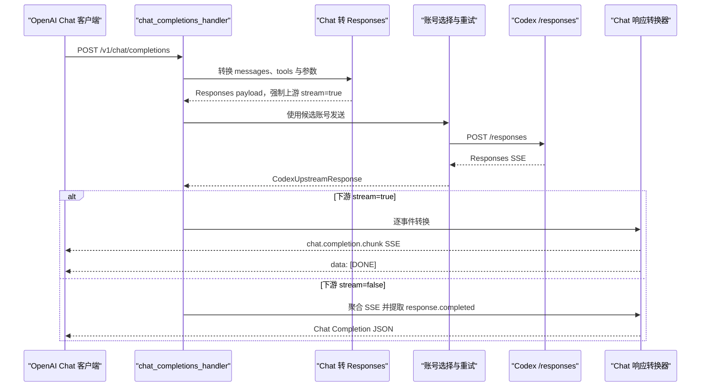

# `POST /v1/chat/completions`

## 请求到上游

下游提交 OpenAI Chat Completions JSON。`chat_completions_handler` 完成 API Key 校验和 JSON 解析，再由 `convert_openai_chat_request_to_codex()` 将 `messages`、工具、推理配置和采样参数转换成 Responses payload。代理记录原始 `stream`，但发给 Codex 时强制 `stream: true`、`store: false`。

上游固定收到：

```http
POST {upstream_base_url}/responses
Accept: text/event-stream
Authorization: Bearer {account_access_token}
ChatGPT-Account-Id: {account_id}
Content-Type: application/json
```

## 上游结果

Codex 返回 Responses SSE，常见事件包括 `response.created`、`response.output_text.delta`、工具调用事件、`response.completed` 和 `response.failed`。

## 下游处理

- `stream: true`：`build_chat_streaming_response()` 用 `SseDecoder` 解析事件，`translate_sse_event_to_chat_chunk()` 转成 `chat.completion.chunk`；结束时发送 `data: [DONE]`。
- `stream: false`：`into_bytes()` 收完整 SSE，提取 `response.completed.response`，再由 `convert_completed_response_to_chat_completion()` 转成普通 Chat Completion JSON。
- 流读取失败：流式路径发送包含错误消息的 `data:`，随后发送 `[DONE]`；非流式路径返回 `502` JSON。



实现入口：`chat_completions_handler`、`build_chat_streaming_response`、`convert_completed_response_to_chat_completion`。
