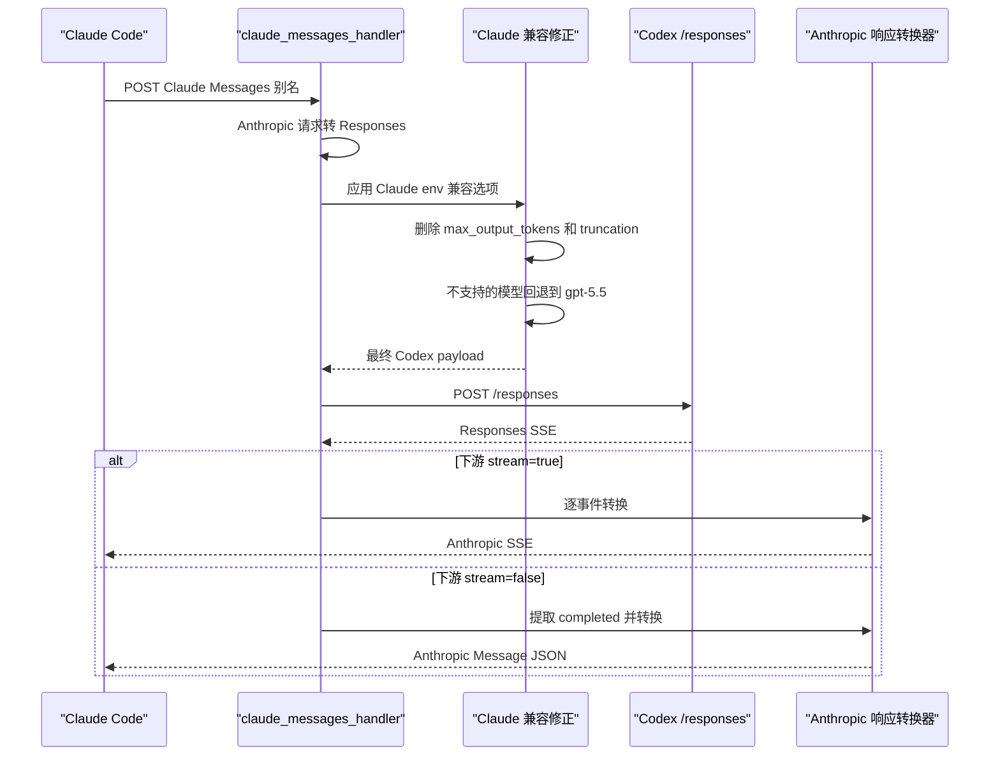

# Claude Messages 别名接口

适用路由：

- `POST /v1/claude/v1/messages`
- `POST /v1/claude/messages`

## 请求到上游

这两个路由共用 `claude_messages_handler`，首先复用 Anthropic Messages 到 Responses 的转换，然后执行 Claude Code 兼容修正：

- Anthropic `max_tokens` 是有效下游输入，但最终 Codex payload 不会包含 `max_output_tokens`；
- 源请求或中间 payload 里的 `truncation` 也会被删除；
- Codex 上游当前会拒绝 `max_output_tokens` 和 `truncation`，因此 Claude 兼容层不再提供这些字段的环境变量覆盖；
- 当转换后的模型缺失或不在本地支持列表时，回退到 `gpt-5.5`；
- 将最终 Codex payload 打印到 stdout，便于调试。

实时上游验证可按需手动运行：

```bash
CODEX_TOOLS_LIVE_ACCESS_TOKEN=... \
CODEX_TOOLS_LIVE_ACCOUNT_ID=... \
CODEX_TOOLS_LIVE_BASE_ORIGIN=https://chatgpt.com \
cargo test --manifest-path src-tauri/Cargo.toml live_codex_upstream_accepts_anthropic_converted_payload --lib -- --ignored --nocapture
```

随后仍调用 Codex `POST /responses`，并使用账号池、Token 刷新和故障切换机制。

Claude Code context management 仍是本地兼容层行为：代理只校验 `context_management.edits`，本地接受 `compact_20260112` 和 `clear_thinking_20251015`，不会把 `context_management` 透传给 Codex，并保留 compaction summary / thinking / redacted_thinking 的安全文本，不调用未公开的 `/responses/compact`。`clear_thinking_20251015.keep` 可省略、为 `"all"`，或为 `{ "type": "thinking_turns", "value": 正整数 }`；其它 edit type 仍会被拒绝。

## 上游结果与下游处理

上游返回 Responses SSE。流式和非流式处理与 `/v1/messages` 相同：分别转换成 Anthropic SSE 或 Anthropic Message JSON。并行/交错工具调用按 Responses item/output index 跟踪；非法非空 function arguments、流读取失败或 EOF 前没有终止事件会返回显式错误，不会伪造正常完成。



实现入口：`claude_messages_handler`，响应转换复用 `build_anthropic_streaming_response` 和 `convert_completed_response_to_anthropic_message`。
