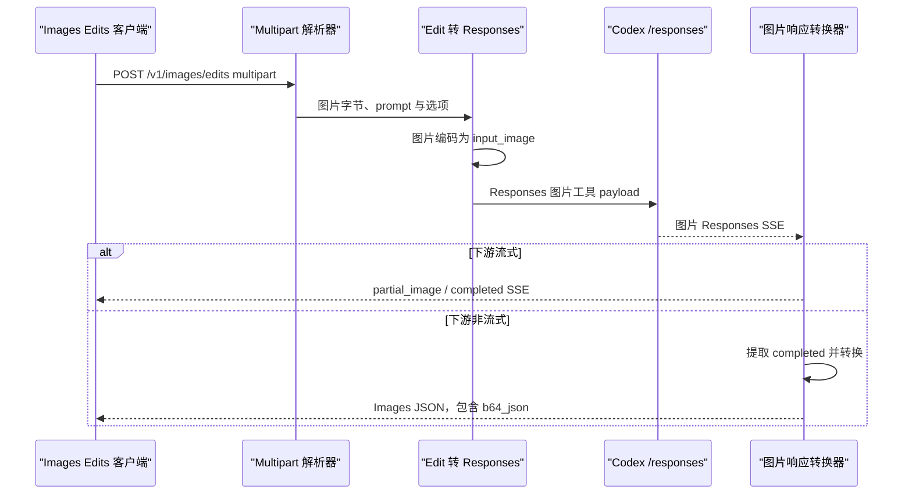

# `POST /v1/images/edits`

## 请求到上游

下游使用 `multipart/form-data` 上传图片及编辑参数。`parse_image_multipart_request()` 读取文件和普通字段，`convert_openai_image_edit_request_to_codex(request, false)` 将上传图片编码成 Responses `input_image`，并结合 prompt 构造图片工具请求。

转换完成后由 `forward_image_request()` 发到 Codex `POST /responses`。

## 上游结果与下游处理

上游返回图片 Responses SSE。后续处理与 generations 共用：流式时转换部分图片/完成事件并输出 SSE；非流式时提取完成响应，转换成包含 `b64_json` 的 OpenAI Images JSON。请求多张图片时会重复调用上游并合并结果。

实现入口：`image_edits_handler`、`parse_image_multipart_request`、`convert_openai_image_edit_request_to_codex`、`forward_image_request`。
