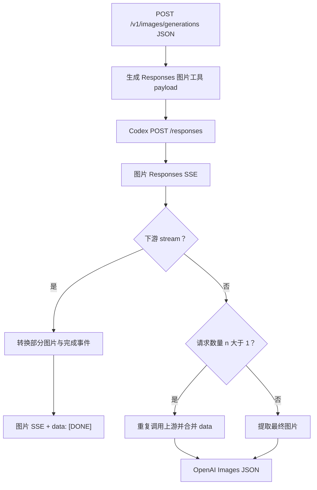

# `POST /v1/images/generations`

## 请求到上游

下游提交 OpenAI Images JSON。`convert_openai_image_generation_request_to_codex()` 将 `prompt`、模型、尺寸、质量、输出格式、数量和流式选项转换成一个 Responses 请求，其中包含 Codex 图片生成工具调用。

`forward_image_request()` 将 payload 发到 Codex `POST /responses`。当非流式请求的 `n > 1` 时，代码会重复调用上游，每次收集一个结果，再合并为一个 Images 响应。

## 上游结果

Codex 返回 Responses SSE，图片相关事件可能包含部分图片 Base64，以及完成事件中的最终图片输出。

## 下游处理

- 流式：`build_image_streaming_response()` 转换为 `image_generation.partial_image`、`image_generation.completed` 等 `data:` 块，结束时发送 `[DONE]`。
- 非流式：提取 `response.completed`，`convert_responses_image_output_to_images_response()` 生成包含 `b64_json` 的 OpenAI Images JSON；多次上游调用的 `data` 数组合并后返回。

实现入口：`image_generations_handler`、`convert_openai_image_generation_request_to_codex`、`forward_image_request`。
