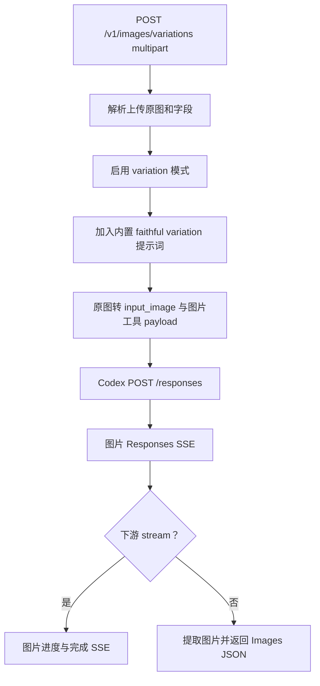

# `POST /v1/images/variations`

## 请求到上游

下游使用 `multipart/form-data` 上传原图。处理步骤与 edits 相同，但调用：

```rust
convert_openai_image_edit_request_to_codex(&request, true)
```

`true` 表示 variation 模式；转换器使用内置 variation 提示词 `Create a faithful variation of the provided image.`，把原图作为 `input_image`，生成 Codex Responses 图片工具 payload。

## 上游结果与下游处理

上游仍返回图片 Responses SSE。流式路径转换成图片进度/完成 SSE；非流式路径提取最终图片并返回 OpenAI Images JSON。`n > 1` 时重复请求上游并合并图片数组。



实现入口：`image_variations_handler`、`convert_openai_image_edit_request_to_codex`、`forward_image_request`。
