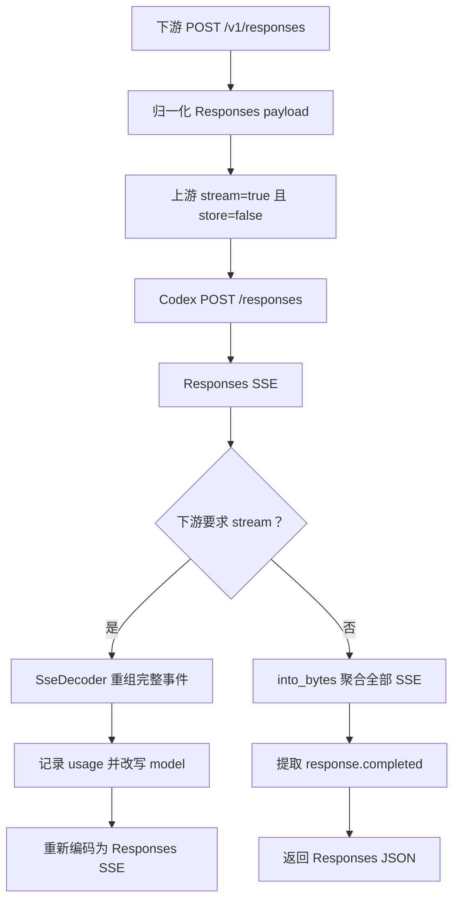

# `POST /v1/responses`

## 请求到上游

下游提交 OpenAI Responses JSON。`normalize_openai_responses_request()` 会：

- 校验并映射 `model`；
- 保存下游请求的 `stream` 值；
- 强制上游 `stream: true`、`store: false`；
- 补齐 `instructions`、`parallel_tool_calls`、`reasoning` 和 `include` 默认值；
- 将 `fast` 归一化为上游的 `priority`；
- 删除上游不接受的 `metadata`、`prompt_cache_retention`。

转换后的 payload 被发送到 Codex `POST /responses`。

## 上游结果

上游返回原生 Responses SSE。代理关注 `response.output_text.delta`、`response.output_item.done`、`response.completed`、`response.failed` 以及包含 usage 的事件。

## 下游处理

- `stream: true`：`build_passthrough_sse_response()` 解码完整 SSE 事件，记录用量，递归改写 JSON 中的模型名，然后重新编码为 Responses SSE。
- `stream: false`：收完整 SSE；累积文本 delta 和完成的 output item；提取 `response.completed.response`；补齐必要输出后返回 Responses JSON。
- 上游流中途报错时，当前流式路径直接结束 body，不额外发送 `response.failed`。下游必须以终止事件判断成功，不能只依赖 EOF。

实现入口：`responses_handler`、`normalize_openai_responses_request`、`build_passthrough_sse_response`、`extract_completed_response_from_sse`。
