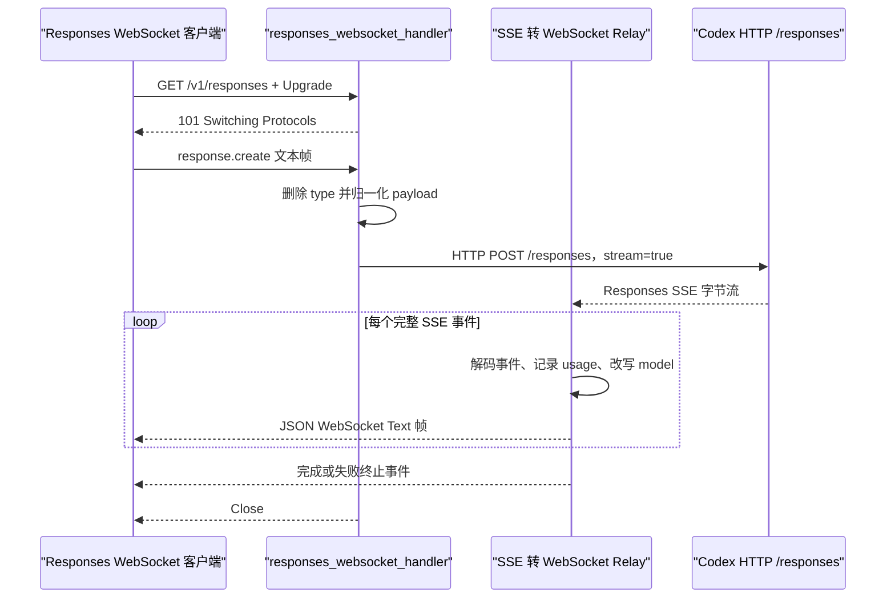

# `GET /v1/responses` WebSocket

## 请求到上游

客户端先对 `GET /v1/responses` 发起 WebSocket Upgrade。连接建立后，第一条文本帧必须是带 `type: response.create` 的 JSON，或者不带 `type` 的 Responses payload。

`normalize_responses_websocket_create()` 删除传输包装字段 `type`，强制 `stream: true`，然后复用 Responses HTTP 的归一化逻辑。当前代理访问 Codex 时仍走 HTTP SSE，而不是上游 WebSocket，因为 `should_use_responses_websocket()` 固定返回 `false`。

## 上游结果

Codex 返回 Responses SSE；代理将其封装成 `CodexUpstreamResponse::Http`。

## 下游处理

`relay_responses_sse_to_websocket()` 调用 `into_stream()`，用 `SseDecoder` 拆出事件，将每个 `data` JSON改写模型名后作为一条 WebSocket Text 消息发送。收到 Responses 终止事件后停止；异常时向客户端发送错误帧，最后关闭连接。

实现入口：`responses_websocket_handler`、`handle_responses_websocket`、`relay_responses_sse_to_websocket`。
