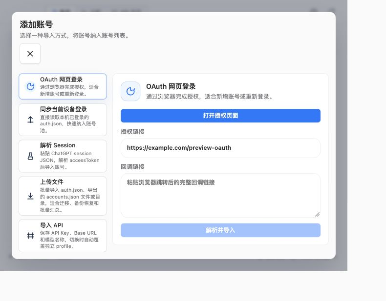
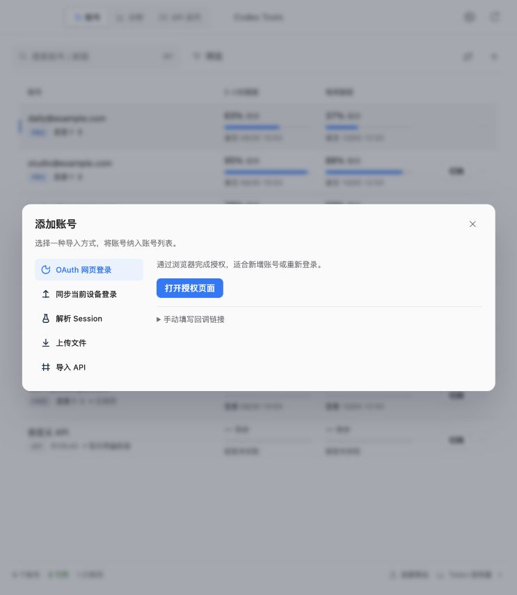
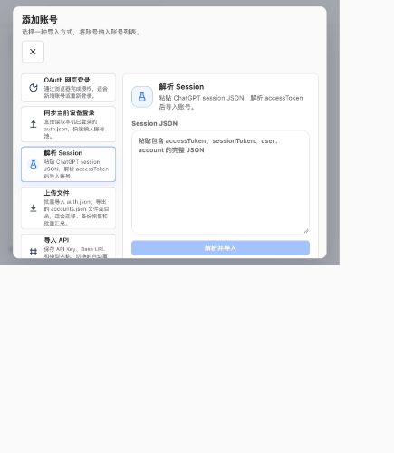
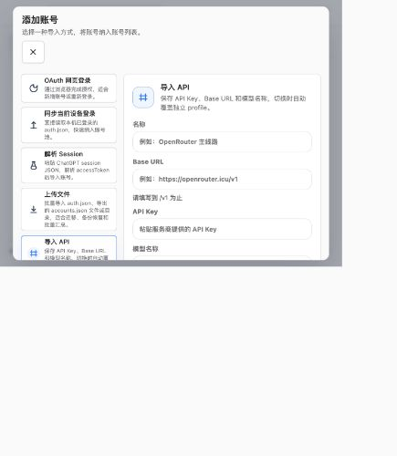
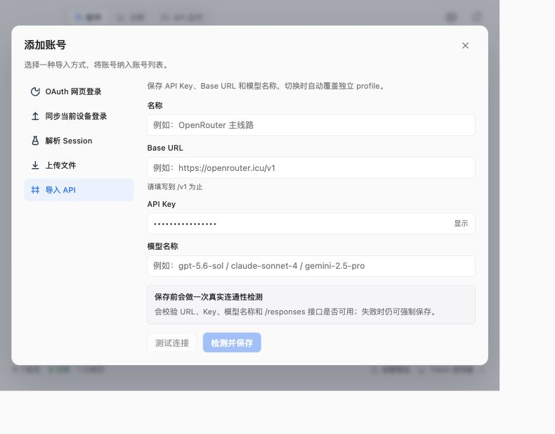
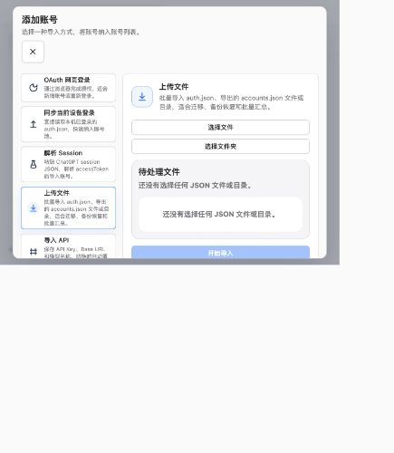
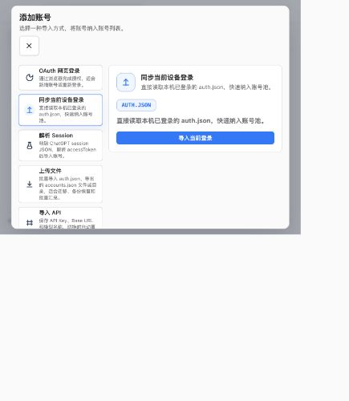

# 添加账号界面审查与修正

范围：本地 Codex Tools 添加账号弹窗的五种导入方式、键盘焦点、敏感字段显示及小窗口布局。审查使用本次实际捕获的 WebKit 预览截图与 DOM/键盘操作；预览后端是隔离的模拟数据。

主要根因是原网页响应式样式在 900px 以下将 `.settingsHeader` 改为纵向，并让操作按钮铺满宽度。添加账号页仍继承了大型卡片、重复说明和较大的圆角输入框。

## 1. OAuth 登录入口：原有布局和键盘问题已修正

原关闭按钮移到了标题下方，左右重复介绍 OAuth，手动回调表单占据主要区域。打开弹窗后键盘焦点仍留在背景“添加账号”按钮。

修正为固定横向标题栏、右上角小型关闭按钮、简短导航与单份说明；手动回调按需展开。打开后焦点进入弹窗，Tab/Shift+Tab 在弹窗内循环，Escape 关闭后恢复到触发控件。

## 2. Session 导入：入口保留，重复说明已去除

原侧栏与内容区域重复 Session 说明，大型导航卡片使弹窗偏高。在当前小窗口下，标题或最后一项导航需要滚动才能完整查看。

修正后导航仅展示方式名称，说明仅保留一处；标题栏不参与表单滚动。Session JSON 输入和解析操作保留。

## 3. API 导入：密钥默认遮挡，操作区已收紧

API Key 输入框没有 password 类型，默认明文显示。原操作按钮和验证区占据过多空间。

新增受控的密钥输入组件，默认隐藏，用户可显示或隐藏，切换显示方式不会改变字段值。测试连接、检测保存及失败后的强制保存流程保持原有回调，操作按钮改为紧凑并排。

## 4. 文件导入：入口完整，空队列说明已合并

“还没有选择任何 JSON 文件或目录”在队列标题区和空状态内重复出现。选择文件和文件夹按钮竖向堆叠。

保留文件与文件夹选择、已选文件列表和开始导入操作。空队列说明仅展示一次，选择控件并排；隐藏的原生文件输入不参与键盘焦点循环。

## 5. 当前设备同步：单一操作已回归紧凑布局

同一段设备登录说明出现三次，一个同步操作仍被大型侧栏卡片撑成大弹窗。

说明保留一次，去除重复的 AUTH.JSON 装饰区；原“导入当前登录”操作保留。

## 验证与限制

五种导入方式均保留。核对了默认密钥遮挡及显示切换、手动回调展开与键盘可达性、文件/文件夹入口、空队列文案、Tab/Shift+Tab 焦点循环、键盘和鼠标打开后的焦点恢复，以及 640 × 500 窗口内的弹窗和关闭按钮位置。具体记录见 `checks.json`。

这不是完整无障碍合规认证。没有执行真实 OAuth 登录、生产 API 连接、真实 Session 导入或读取用户登录文件。`example.com/preview-oauth` 是预览后端的占位链接，不代表真实授权服务故障。

新增弹窗结构、焦点管理、密钥控件与导入方式图标分属独立模块；保留原授权、导入、连接测试和保存回调。
