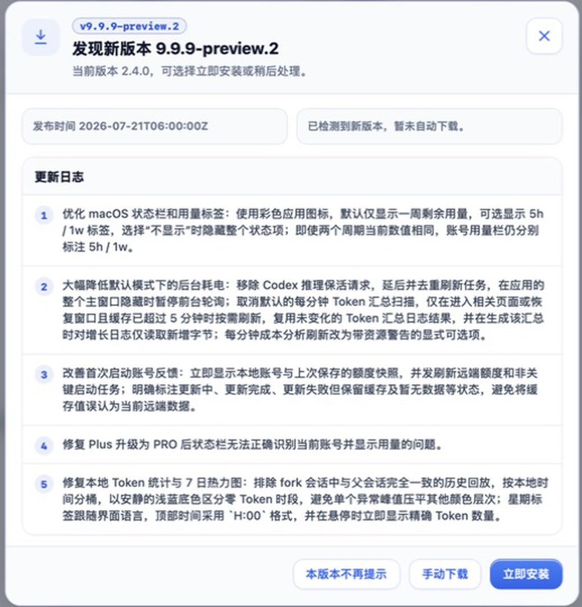
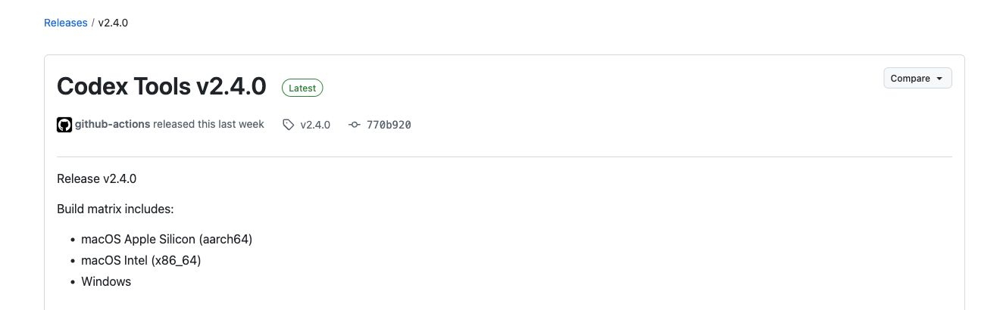
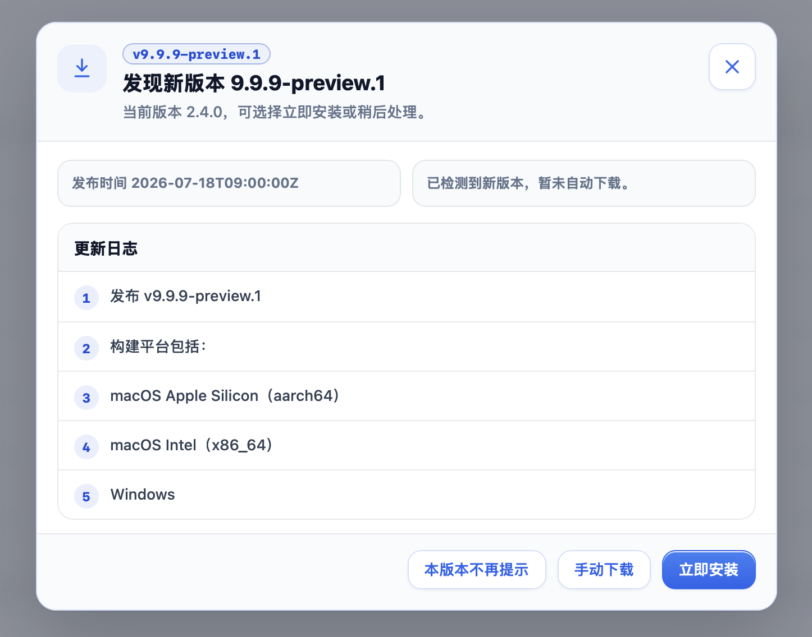

# Next release notes preview / 下一版本更新日志预览

> Preview only: `vNext` is a placeholder and does not select the final release version.
>
> 仅供预览：`vNext` 是占位符，不代表已经确定正式版本号。

## English

1. Improve the macOS status bar and usage labels: use the color app icon, default to showing one-week remaining usage, optionally show 5h / 1w labels, hide the entire status item when disabled, and keep the account meters labeled 5h / 1w even when both values are currently identical.
2. Significantly reduce default background energy use: remove Codex inference keepalive calls, deduplicate refreshes, pause foreground polling while the application's entire main window is hidden, and avoid repeated full log scans by reusing unchanged per-file results and tail-reading appended bytes for both the Token summary and detailed cost analytics. Detailed analytics now refreshes incrementally every minute as a fixed behavior; entering Analytics no longer starts a separate refresh, and the refresh-mode toggle has been removed.
3. Improve first-launch account feedback: show stored accounts and the last saved quota snapshot immediately, refresh remote quota and non-critical startup work concurrently, show freshness only during first-load work, and hide the freshness badge after a successful refresh. Failed or unavailable states remain visible; failures show a concise cause while retaining the full error on hover.
4. Fix startup and the macOS status bar after a Plus-to-Pro upgrade: reuse the cached Pro account when stale auth metadata still says Plus, keep the last quota visible during refresh, and correctly select the current account.
5. Unify local Token analytics and the 7-day heatmap: derive actual increments from cumulative Token snapshots, ignore unchanged rebroadcasts, and exclude verified parent-history replays from forked sessions. Hourly buckets use local time, retain useful color contrast, localize labels, and show exact Token counts immediately on hover. Total, seven-day, project, session, prompt, and heatmap costs now share the same local-log model pricing. The seven-day card uses the previous seven completed local calendar days, while the cost alert uses the rolling latest 168 hours. Analytics no longer requests or caches official Profile activity.

## 中文

1. 优化 macOS 状态栏和用量标签：使用彩色应用图标，默认仅显示一周剩余用量，可选显示 5h / 1w 标签，选择“不显示”时隐藏整个状态项；即使两个周期当前数值相同，账号用量栏仍分别标注 5h / 1w。
2. 大幅降低默认模式下的后台耗电：移除 Codex 推理保活请求，去重刷新任务，在应用的整个主窗口隐藏时暂停前台轮询；Token 汇总与详细成本分析都会复用未变化文件的逐文件结果，并对增长日志采用尾量读取，避免反复完整扫描。详细分析现固定为每分钟增量刷新；进入分析页不再额外触发刷新，并移除刷新模式 toggle。
3. 改善首次启动账号反馈：立即显示本地账号与上次保存的额度快照，并发刷新远端额度和非关键启动任务；新鲜度提示仅在首次加载期间出现，刷新成功后自动隐藏。失败或暂无数据状态仍会保留，其中失败提示直接显示简短原因，悬停时仍可查看完整错误。
4. 修复 Plus 升级为 PRO 后的启动与状态栏账号识别：当认证元数据仍显示 Plus 时复用带缓存的 PRO 账号，刷新期间继续显示上次额度，并正确选中当前账号。
5. 统一本机 Token 分析与 7 日热力图：根据累计 Token 快照计算实际增量，忽略累计值未变化的重复广播，并排除 fork 会话中已验证的父会话历史回放。小时数据按本地时间分桶，保留有效色阶，标签跟随界面语言，并在悬停时立即显示精确 Token 数量。总成本、7 日成本、项目、会话、prompt 与热力图现共用相同的本机日志模型计价。7 日成本采用前 7 个完整本地自然日，成本预警采用滚动最近 168 小时。分析页不再请求或缓存官方 Profile 活动量。

## In-app appearance / 应用内效果

## Publication mapping / 发布映射

- GitHub Release body: both language sections above.
- Tauri updater `latest.json.notes`: the same bilingual body.
- In-app dialog: selects Chinese for a Chinese UI and English for other locales, with fallback when only one language is available.
- Missing optional notes: emit a build warning, use generated generic release text, and continue publishing.

- GitHub Release 正文：包含以上中英文两部分。
- Tauri updater 的 `latest.json.notes`：写入同一份双语正文。
- 应用内弹窗：中文界面选择中文，其他语言界面选择英文；只有一种语言时自动回退显示可用内容。
- 缺少可选更新说明：输出构建警告，使用自动生成的通用发布文字，并继续发布。

## Missing-notes fallback / 缺少说明时的回退

If a release tag has neither a matching version entry nor reusable `Unreleased` content, the workflow emits a warning and continues with a generated bilingual version-and-platform summary. The existing `v2.4.0` release below shows the repository's historical generic structure; the new fallback keeps that structure and adds both language sections.

如果发布标签既没有匹配的版本条目，也没有可复用的 `Unreleased` 内容，工作流会输出警告，并使用自动生成的双语版本与构建平台摘要继续发布。下面现有的 `v2.4.0` Release 展示了仓库原有的通用结构；新的回退会保留这一结构并补充中英文两个部分。

The in-app updater selects the matching language section from the same generated body. In a Chinese UI it therefore shows the concise Chinese version-and-platform fallback instead of an empty changelog.

应用内更新器会从同一份自动生成正文中选择当前界面的语言。因此中文界面会显示简洁的中文版本与构建平台回退内容，而不是空白更新日志。

